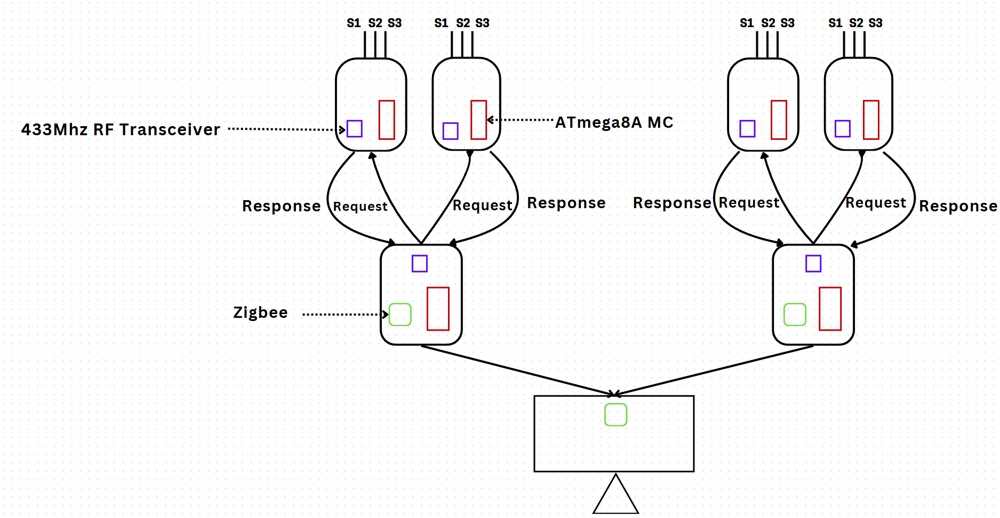
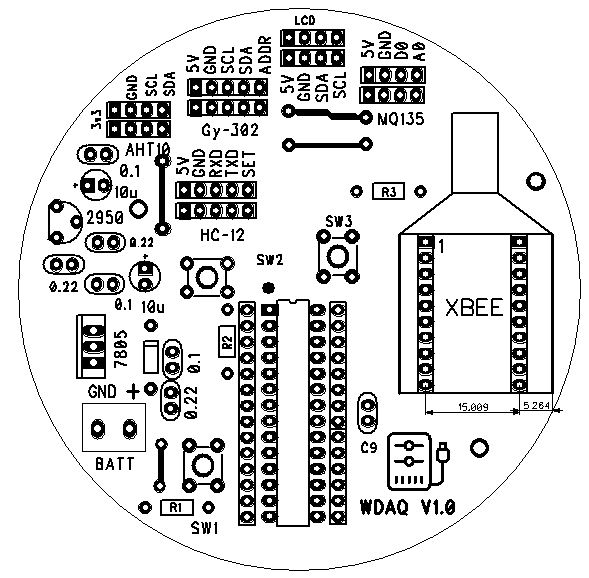
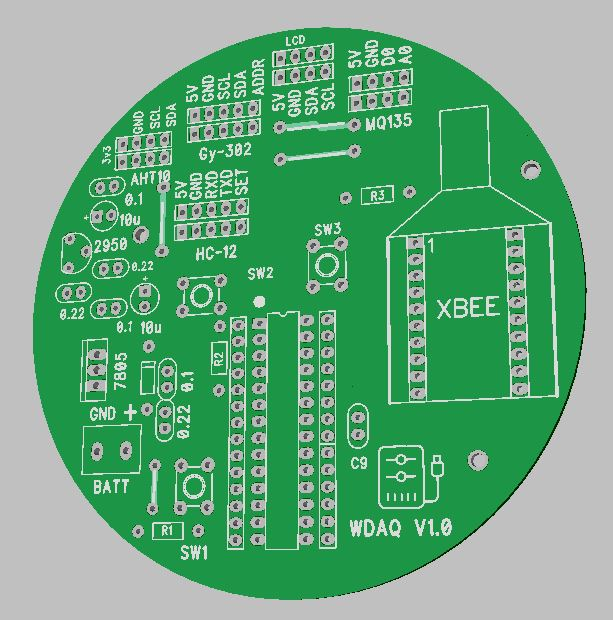

# Zigbee based Wireless Data Acquistion System

This project is a custom-designed wireless data acquisition system built around Zigbee communication and the ATmega8A microcontroller. The system is developed for efficient and low-power remote sensing across three specialized nodes. It combines 433 MHz RF modules and Zigbee modules (Xbee3) to create a reliable multi-hop wireless network for environmental data collection.

## System Overview
The system consists of the following three interconnected nodes:

    1. Data Collection Node (Sensor Node)
    Microcontroller: ATmega8A
    Transceiver: 433 MHz RF Module
    Sensors: AHT10, GY-302, MQ135

    Function: Collects data from connected sensors and transmits it via RF to the aggregation node.

    2. Data Aggregation Node
    Microcontroller: ATmega8A
    Transceivers: 433 MHz RF Module + Xbee3

    Function: Acts as a bridge between the RF-based sensor nodes and the Zigbee network. Aggregates and forwards data to the Zigbee Endpoint.

    3. Zigbee Endpoint (Receiver Node)
    Microcontroller: ATmega8A
    Module: Xbee3

    Function: Receives Zigbee packets and sends data to a PC or cloud-connected interface for logging, display, or further processing.

Custom Firmware
Each node runs custom-developed firmware written in Embedded C and C++, optimized for maximum Code Density.

## Block Diagram / Methodology

## PCB

